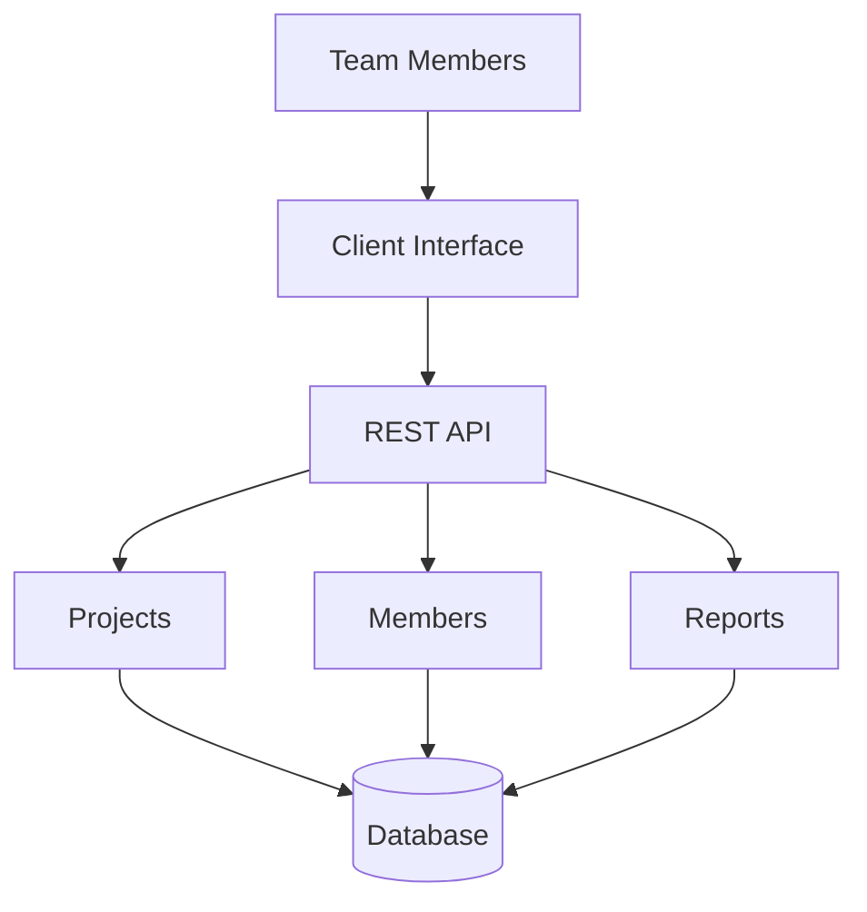

# TeamFlow Workspace Architecture

```mermaid
flowchart TD
    A["Team Members"] --> B["Client Interface"]
    B --> C["REST API"]
    C --> D["Projects"]
    C --> E["Members"]
    C --> F["Reports"]
    D --> G[("Database")]
    E --> G
    F --> G
```
