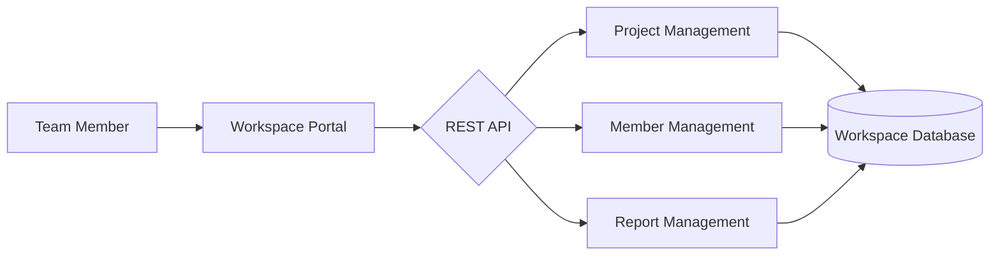

# TeamFlow Workspace Architecture

```mermaid id="m8v2q1"
flowchart LR
    A[Team Member] --> B[Workspace Portal]
    B --> C{REST API}
    C --> D[Project Management]
    C --> E[Member Management]
    C --> F[Report Management]
    D --> H[(Workspace Database)]
    E --> H
    F --> H
```
