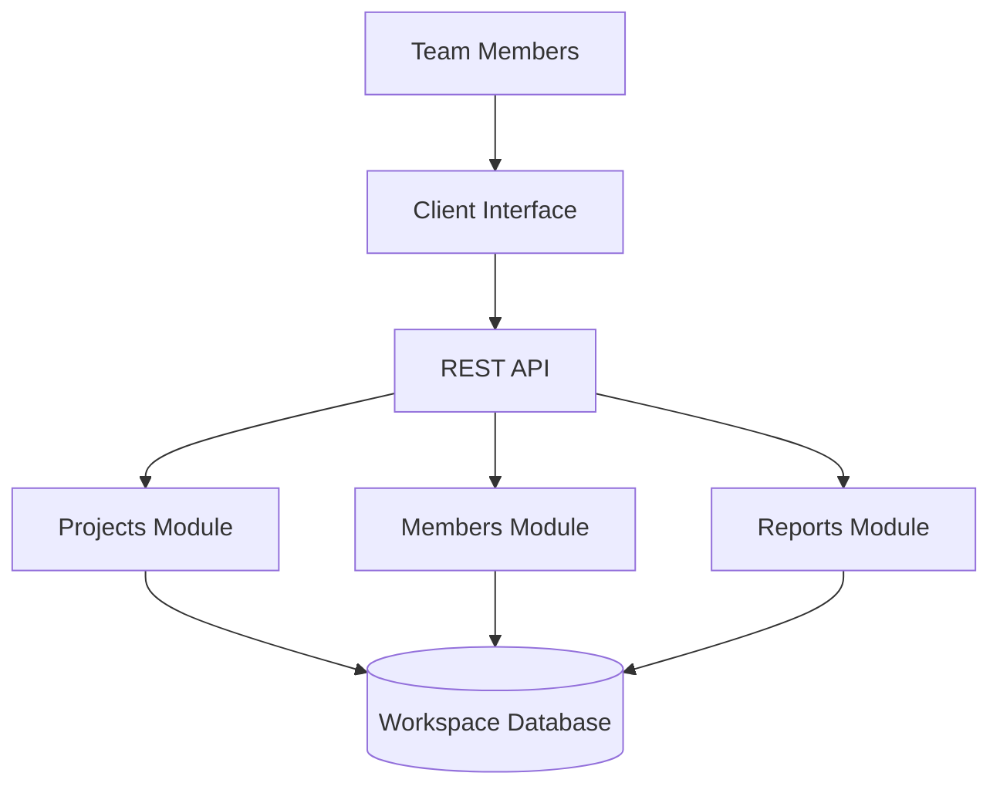

# TeamFlow Workspace - Architecture Diagram

```mermaid
flowchart TD
    A["Team Members"] --> B["Client Interface"]
    B --> C["REST API"]
    C --> D["Projects Module"]
    C --> E["Members Module"]
    C --> F["Reports Module"]
    D --> G[("Workspace Database")]
    E --> G
    F --> G
```
